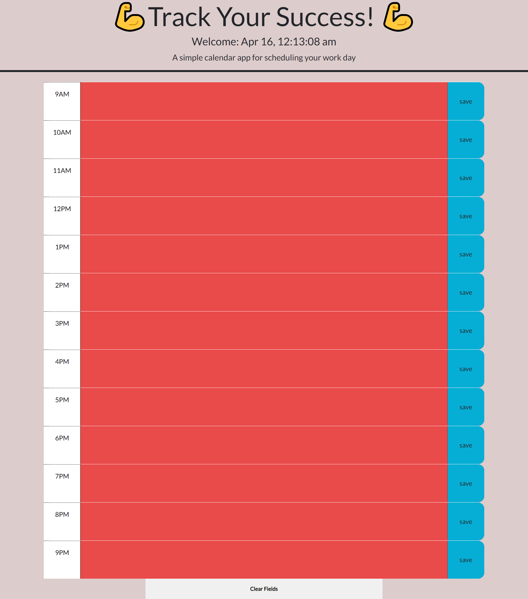

# Track Your Success

## Description

This calendar app follows a complete day for people to organize their work and over all day. Tasks, errands, even any accomplishments made that day, the user can visually see all in one place.

- The motivation for creating a site like this would be to track and remind the user how awesome they are! Come and use this specific app with its minimalist charm

- Behind the scenes, I was able to refactor this starter code to truly make the site interactive with responsive time, create calls to local storage, and most importantly, allow the fields to be cleared and reused each day!

- Not many people give themselves enough credit for what can be done in a day. This is for any user who wants to be more organized and start hour by hour or day by day. In addition, those who are already following their own tasks, they can break it down to a more present level.

- I learned how to operate a third party API like dayjs in order to display the current date and time of the user, powered by jQuery.

## Usage

This responsive calendar will display your local time above. As time goes by, the present hour will always be purple, the past will be red, and the future will be green. Once the day is complete, all boxes will be read. To save a task, simply click the blue save button. Below is a clear fields button to erase the day for tomorrow. 

## License
MIT License

Copyright (c) 2023 Milton Robles

Permission is hereby granted, free of charge, to any person obtaining a copy
of this software and associated documentation files (the "Software"), to deal
in the Software without restriction, including without limitation the rights
to use, copy, modify, merge, publish, distribute, sublicense, and/or sell
copies of the Software, and to permit persons to whom the Software is
furnished to do so, subject to the following conditions:

The above copyright notice and this permission notice shall be included in all
copies or substantial portions of the Software.

THE SOFTWARE IS PROVIDED "AS IS", WITHOUT WARRANTY OF ANY KIND, EXPRESS OR
IMPLIED, INCLUDING BUT NOT LIMITED TO THE WARRANTIES OF MERCHANTABILITY,
FITNESS FOR A PARTICULAR PURPOSE AND NONINFRINGEMENT. IN NO EVENT SHALL THE
AUTHORS OR COPYRIGHT HOLDERS BE LIABLE FOR ANY CLAIM, DAMAGES OR OTHER
LIABILITY, WHETHER IN AN ACTION OF CONTRACT, TORT OR OTHERWISE, ARISING FROM,
OUT OF OR IN CONNECTION WITH THE SOFTWARE OR THE USE OR OTHER DEALINGS IN THE
SOFTWARE.

  